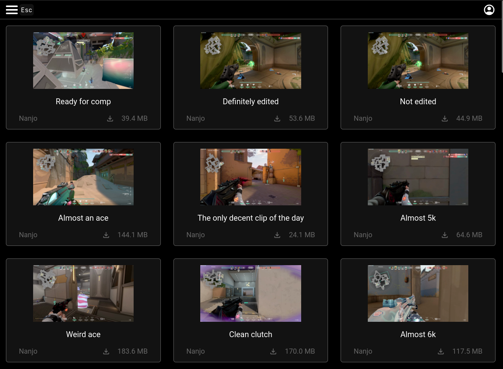
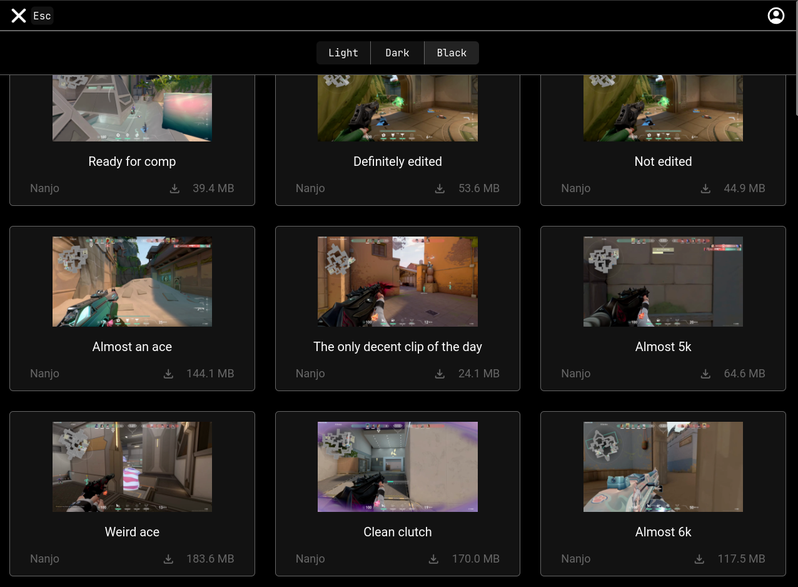
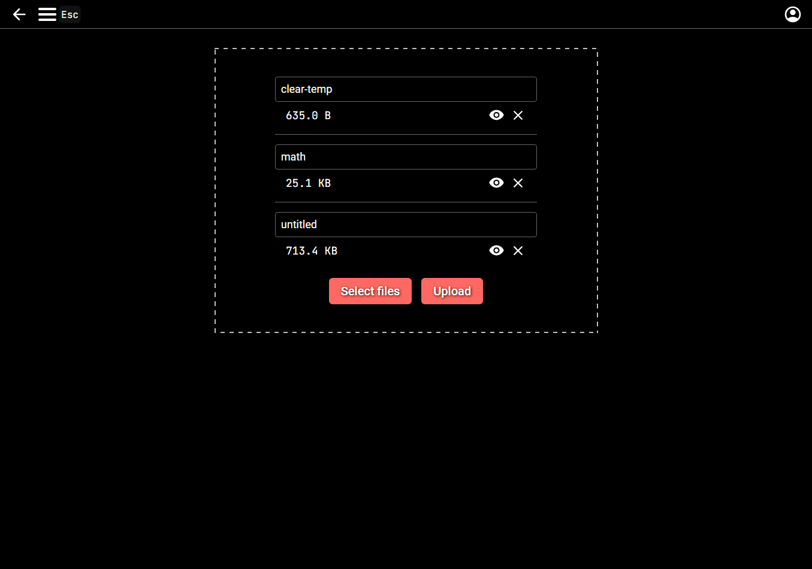

# File Share

## Description

Allows uploading files to a server.
The files can be either public or private,
which will hide them from the file list.
Files can currently only be deleted by the owner,
but in the future there will be an admin UI where the admin(s) can delete any files.
There will also be a configurable maximum file size that the admin can control.

The website has 3 different themes: light, dark and black (OLED).

The default foreground accent color is pastel red (#FF6961),
but can easily be changed in the CSS variables within app.vue

There is also a /watch page for video files,
which will have a custom video player in a future update,
but for now just has the default HTML video player.

The links generated after upload are embed links,
which can be used on social media platforms such as [Discord](https://discord.com/) in order to get a preview,
which has a video player in it. This has been tested with [Discord](https://discord.com/),
but should work with other social media sites that support [OG](https://ogp.me/) metadata.

The app has been developed using [Bun](https://bun.sh/),
and the npm scripts are created for it as well.

## Screenshots

File list:



Theme select:



Upload page:



## Configuration

The server configuration is done using the following environment variables:

| Name                      | Example value                                | Description                                                                               |
| ------------------------- | -------------------------------------------- | ----------------------------------------------------------------------------------------- |
| FILESHARE_PORT            | 8443                                         | The port that the application is hosted on (the reverse proxy should point to this port)  |
| FILESHARE_BASE_URL        | https://fileshare.example.com                | The public URL for the website                                                            |
| FILESHARE_DB_URL          | file:/var/www/fileshare/prisma/fileshare.db  | Absolute file URL to the SQLite file                                                      |
| FILESHARE_FILES_PATH      | /var/www/fileshare/uploads/files             | Absolute file path, which is used as the destination for uploaded files                   |
| FILESHARE_THUMBNAILS_PATH | /var/www/fileshare/uploads/thumbnails        | Absolute file path, which is used as the destination for the thumbnails of uploaded files |
| FILESHARE_SECRET          | QhxqJTJ8g3AczeCWMv5hRoIXpuLvSXb+shzNqlw4xr0= | A long random value that is used to encrypt sessions                                      |

## Development

Look at the [Nuxt 3 documentation](https://nuxt.com/docs/getting-started/introduction) to learn more.

### Setup

Make sure to install the dependencies:

```bash
# npm
npm install

# pnpm
pnpm install

# yarn
yarn install

# bun
bun install
```

### Development Server

Start the development server on `http://localhost:3000`:

```bash
# npm
npm run dev

# pnpm
pnpm run dev

# yarn
yarn dev

# bun
bun run dev
```

### Production

Build the application for production:

```bash
# npm
npm run build

# pnpm
pnpm run build

# yarn
yarn build

# bun
bun run build
```

Locally preview production build:

```bash
# npm
npm run preview

# pnpm
pnpm run preview

# yarn
yarn preview

# bun
bun run preview
```

Start PM2 for production build:

```bash
# npm
npm run start

# pnpm
pnpm run start

# yarn
yarn start

# bun
bun run start
```

Check out the [deployment documentation](https://nuxt.com/docs/getting-started/deployment) for more information.
