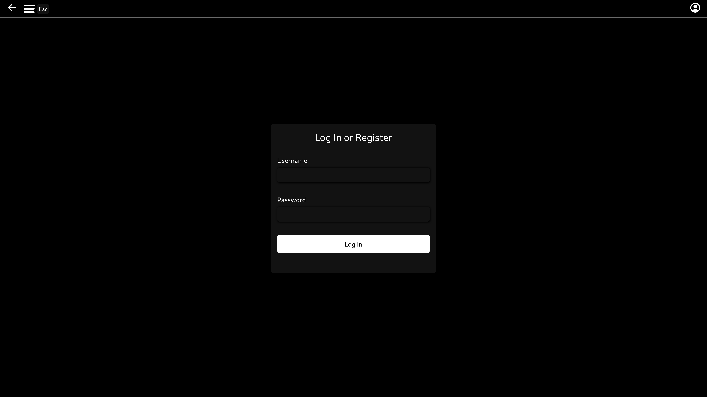
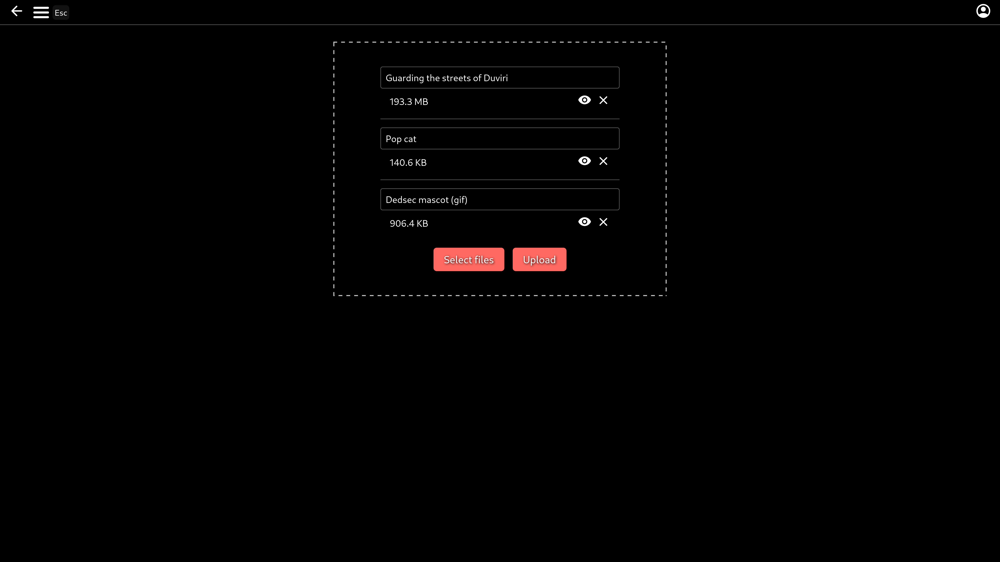
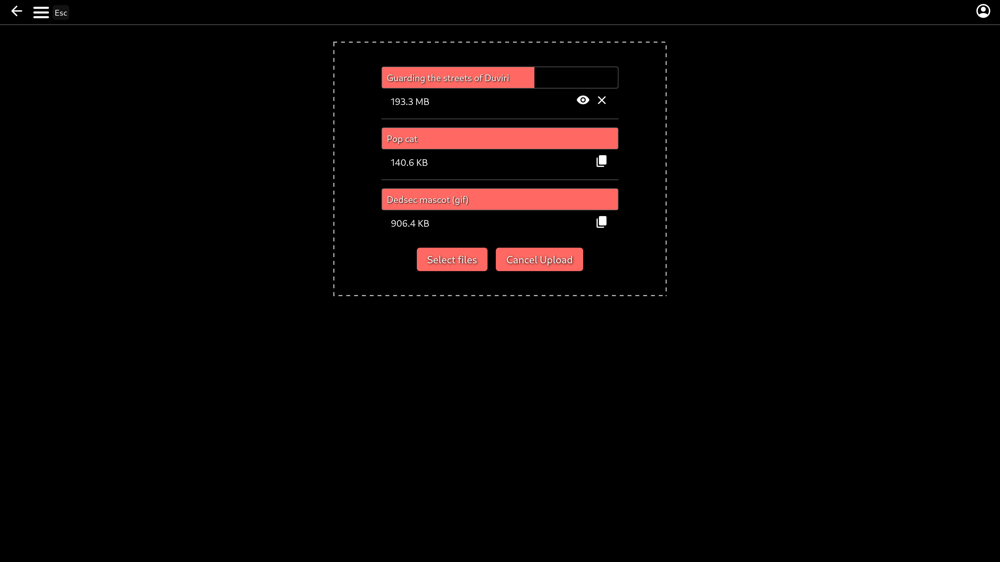

# File Share

## Description

Allows uploading files to a server.
The files can be either public or private, which will hide them from the file list.
Files can currently only be deleted by the owner,
but in the future there will be an admin UI where the admin(s) can delete any files.
There will also be a configurable maximum file size that the admin can control.

The website has 3 different themes: light, dark and black (OLED).

The default foreground accent color is pastel red (#FF6961),
but can easily be changed in the CSS variables within app.vue

There is also a /watch page for video files, and comments can be created for these files.

The links generated after upload are embed links,
which can be used on social media platforms such as [Discord](https://discord.com/) in order to get a preview,
which has a video player in it. This has been tested with [Discord](https://discord.com/),
but should work with other social media sites that support [OG](https://ogp.me/) metadata.

## Deployment

In order to deploy this project, you must set the following environment variables.
For more information see [Configuration](#configuration).

- FILESHARE_DB_URL
- FILESHARE_UPLOADS_PATH OR
    - FILESHARE_FILES_PATH
    - FILESHARE_THUMBNAILS_PATH

```bash
# Initialize/update database
npm install --include=dev
npx prisma migrate dev --name deploy
npx prisma db seed
```

### Docker

**You must set `FILESHARE_DB_PATH` and `FILESHARE_DB_NAME` environment variables instead of `FILESHARE_DB_URL`**

The easiest way to deploy this project is using the included [docker compose file](./docker-compose.yml).

```bash
docker compose up -d
```

Alternatively you can build your own docker image using the included dockerfile

```bash
npm install --include=dev
npm run build
docker compose up -d --build
```

### Node

```bash
npm install --include=dev
npm run build
node .output/server/index.mjs
```

## Screenshots

File list:


Theme select:


Login page:



Upload page:





Watch page:


Comments on watch page:


## Database

This app uses Prisma ORM and SQLite 3 as the database


## Configuration

The server configuration is done using the following environment variables:

| Name                      | Example value                                | Description                                              |
| ------------------------- | -------------------------------------------- | -------------------------------------------------------- |
| FILESHARE_PORT            | 3000                                         | The port that the application is hosted on               |
| FILESHARE_DB_NAME         | fileshare.db                                 | Filename of SQLite database                              |
| FILESHARE_DB_URL          | file:/var/www/fileshare/db/fileshare.db      | Absolute file URL to the SQLite file                     |
| FILESHARE_DB_PATH         | /var/www/fileshare/db                        | Absolute path to database directory                      |
| FILESHARE_THUMBNAILS_PATH | /var/www/fileshare/uploads/thumbnails        | Absolute path to uploaded thumbnails directory           |
| FILESHARE_FILES_PATH      | /var/www/fileshare/uploads/files             | Absolute path to uploaded files directory                |
| FILESHARE_UPLOADS_PATH    | /var/www/fileshare/uploads                   | Absolute path to uploaded files and thumbnails directory |
| FILESHARE_SECRET          | QhxqJTJ8g3AczeCWMv5hRoIXpuLvSXb+shzNqlw4xr0= | A long random value that is used to encrypt sessions     |

## Development

Look at the [Nuxt 3 documentation](https://nuxt.com/docs/getting-started/introduction) to learn more.

### Setup

Make sure to install the dependencies:

```bash
# npm
npm install

# pnpm
pnpm install

# bun
bun install
```

### Development Server

Start the development server on `http://localhost:3000`:

```bash
# npm
npm run dev

# pnpm
pnpm run dev

# bun
bun run dev
```

### Production

Build the application for production:

```bash
# npm
npm run build

# pnpm
pnpm run build

# bun
bun run build
```

Locally preview production build:

```bash
# npm
npm run preview

# pnpm
pnpm run preview

# bun
bun run preview
```

Start production build:

```bash
# node
node .output/server/index.mjs

# bun
bun .output/server/index.mjs
```

Check out the [deployment documentation](https://nuxt.com/docs/getting-started/deployment) for more information.
